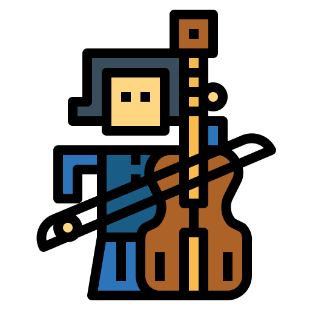

# Charles Gosme Music
#### Client-side



Discover the music of Charles Gosme

### Built With

* [React](https://reactjs.org/)
* [Node.js](https://nodejs.dev/)
* [Express](https://expressjs.com/)
* [mySQL](https://www.mysql.com/)

## Getting Started

To get a local copy up and running follow these simple example steps.

### Prerequisites

Here is a list things you need in order to use the software and how to install them.
* npm
  ```sh
  npm install npm@latest -g
  ```
* [node.js](https://nodejs.org/en/download/)
* [mySQL](https://dev.mysql.com/downloads/installer/)

### Installation

1. Clone the repo
   ```sh
   git clone git@github.com/AnnaGosme/charles_gosme_client.git
   ```
2. Install NPM packages
   ```sh
   npm install
   ```
3. Open the app in the browser at http://localhost:3000/
  ```sh
  npm start
  ```
4. Remember to launch the server-side !
5. 
6. Happy coding !
